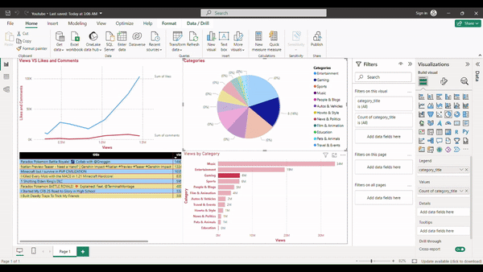

# YouTube Video Analytics Dashboard

## Project Overview

This project involves collecting, preprocessing, and visualizing YouTube video data. The data is collected using the YouTube Data API, stored in a MySQL database, and then visualized using Power BI. The dashboard provides insights into various metrics such as views, likes, comments, and video categories.


## Dashboard Features

1. **Views vs Likes and Comments:**
   - Line graph showing the relationship between views, likes, and comments for each video.

2. **Video by Category (Pie Chart):**
   - Pie chart displaying the distribution of videos across different categories.

3. **Views by Category (Bar Graph):**
   - Bar graph showing the total views for each video category.

4. **Video Details Table:**
   - A comprehensive table containing detailed information about each video, including title, views, likes, comments, duration, published date, and time.



## Data Collection and Preprocessing

The data collection and preprocessing are handled using Python scripts. The following steps outline the process:

1. **Fetch YouTube Video Data:**
   - Use the YouTube Data API to fetch details of trending videos.

2. **Store Data in MySQL Database:**
   - Store the fetched data in a MySQL database, ensuring the data is up-to-date with each API call.

3. **Fetch and Store YouTube Categories:**
   - Use the YouTube Data API to fetch video categories and store them in a MySQL database.

4. **Export Data to CSV:**
   - Export the video data from the database to a CSV file, including the category titles and cleaning the 'published_at' and 'duration' columns.

## Project Structure

- **Data Collection.ipyb**: Contains Python scripts for data collection and preprocessing.
  - Fetches YouTube video data and stores it in the MySQL database.
  - Fetches YouTube video categories and stores them in the MySQL database.
  - Exports the processed data from the MySQL database to a CSV file.
  - Cleans the CSV file and prepares it for visualization.

- **YouTube.pbix**:Power BI dashboard file.

- **youtube_videos_with_categories.csv**: CSV file with processed YouTube video data.

## Usage

### Prerequisites

- Python 3.x
- MySQL Database
- Power BI Desktop

### Setup

1. **Clone the Repository:**
   ```bash
   git clone https://github.com/DataScientistArnav/YoutubeDashboard.git
   cd YoutubeDashboard
   
2. **Configure MySQL Database:**

   Update the config.py file with your MySQL database credentials and YouTube API key.
  
3. **Open Power BI Dashboard:**
   - Open YouTube.pbix in Power BI Desktop.
   - Refresh the data to load the latest CSV file.
### Dashboard Overview

The Power BI dashboard provides the following insights:

- Scatter Plot (Views vs Likes and Comments): Analyzes the relationship between views, likes, and comments.
- Pie Chart (Video by Category): Shows the distribution of videos across different categories.
- Bar Graph (Views by Category): Displays the total views for each video category.
- Table (Video Details): Contains detailed information about each video.

### License
This project is licensed under the MIT License.

### Acknowledgments
- YouTube Data API
- Power BI
